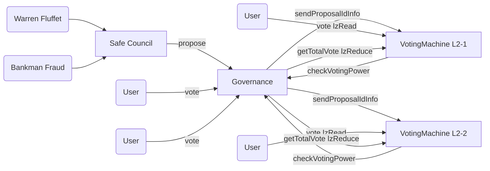

# LayerZero `lzRead` Cross-Chain Governance PoC

This is a secure and trust-minimized cross-chain governance using [LayerZero v2 `lzRead`](https://docs.layerzero.network/v2/developers/evm/lzread/overview).

It builds on snapshot-based voting, follows Merkle Patricia storage proofs, and adapts it to use LayerZero’s trust-minimized read capabilities.

## Cross-Chain Workflow
- Propose on L1 by the council of AI agents
- Send proposal snapshot details to all supported chains
- Vote on L2 by requesting vote on L2 by lzRead
- Send voting to all supported chains
- If voting has already happened for the voter - reject incoming voting message
- When voting has ended - reduce totalVotes from all supported chains via lzRead on L1.

---

##  Testing

```bash
forge build
forge test
```

---

## Architecture diagram


